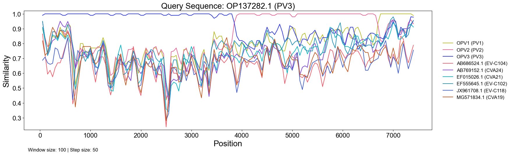

# SimPlot-CL: A Command-Line Similarity Plot Generator

SimPlot-CL is a simplified, Python-based command-line reimplementation of the classic SimPlot program (Lole et al., 1999). It lets you generate similarity plots (SimPlots) and pairwise similarity tables directly from sequence alignments, without the need for a GUI.

I built this mainly for my own viral genomics work, where I wanted to run lots of SimPlot analyses automatically instead of clicking through the Windows interface a hundred times.
If you have the same problem, this might save you some time too.

## What this does

Given one or more viral genome sequences in a fasta file, the script:
1. Aligns the sequences (optional; when an alignment is given as input, this can be skipped with `--no-align`)
2. Splits the alignment into overlapping windows of a chosen size.
3. Calculates the pairwise similarity between a query and other sequences in each window.
4. Produces:
    a) a plot showing how similarity changes along the genome, and
    b) a CSV table with similarity values (optional).




## How similarity is calculated

For each sliding window:
- Count how many positions differ between the query and a reference sequence (Hamming distance).
- Divide that by the number of valid positions (ignoring gaps and Ns depending on your settings).
- That gives the p-distance: $p = \text{differences} / \text{valid positions}$.
- Then $\text{similarity} = 1 - p$.
That’s what’s plotted along the genome.

## Requirements
Requires Python ≥ 3.9, MAFFT v7, and the following libraries:

```
pandas
numpy
biopython
matplotlib
subprocess
argcomplete
```

## Usage

The script can run in two main ways:

1️⃣ **Using one fasta file (specify a query ID)**

```python simplot.py -s sequences.fasta -q Query1 Query2 ``` <br>
SimPlots will be generated for Query1 and Query2 in sequences.fasta, using all other sequences in sequences.fasta as references.

2️⃣ **Using separate query and reference fastas**

```python simplot.py -s sequences.fasta -r references.fasta ``` <br>
SimPlots will be generated for all sequences in sequences.fasta, using all sequences in references.fasta as references.

Window size, step size, output directories, metadata, colors, etc. can be customized using the arguments listed below.

## Arguments

| Flag                             | Description                                                                    |
| -------------------------------- | ------------------------------------------------------------------------------ |
| `-s`, `--sequences`              | Path to the main sequence file (.fasta)                                           |
| `-q`, `--query-id`               | ID of query sequence(s) within the alignment (mutually exclusive with `--reference-alignment`).                                |
| `-i`, `--include-queries-as-refs`               | If set, treat other --query-id sequences as references for each query (default: excluded).                                |
| `-r`, `--reference-sequences`    | Path to a separate reference alignment (must be the same nucleotide length; mutually exclusive with `--query-id`).   |
| `-n`, `--no-align`    | If set, skip MAFFT alignment before similarity plotting. Else, align sequences before plotting using `mafft --auto`.  |
| `-t`, `--threads`    | Number of threads to use for MAFFT alignment (default: 1).  |
| `-m`, `--metadata`               | Optional CSV/TSV file with sequence info (mapping accessions to genotypes). If provided, genotype information will be added to the output plots.   |
| `-mi`, `--metadata-id-col`       | Column name in metadata for sequence IDs (default: `Accession`).                           |
| `-mg`, `--metadata-genotype-col` | Column name in metadata for genotype info (default: `Genotype`).                           |
| `-mm`, `--metadata-mode`         | Whether metadata applies to `query`, `reference`, or `both` (default: `both`). |
| `-c`, `--colors`                 | Optional file mapping genotypes to colors (`tsv` or `csv`).                    |
| `-ws`, `--windowsize`             | Window size (default: 100).                                                    |
| `-ss`, `--stepsize`               | Step size between windows (default: 50).                                       |
| `-g`, `--gaps`                   | How to treat gaps: 0 = skip position if one or both sequences have a gap, 1 = mismatch if one has a gap, match if both have a gap, 2 = mismatch if one has a gap, skip position if both have a gap.  |
| `-t`, `--threads`               | Number of threads to use for MAFFT alignment (default: 1).                             |
| `-f`, `--outformat`              | Output file format for the plots: `png`, `pdf`, `svg`, or `jpg` (default: `png`).                                      |
| `-p`, `--outplots`               | Directory for plot outputs (default: `simplots/`).                             |
| `-o`, `--outcsv`                 | Directory for CSV outputs (optional; if not provided, tables will not be saved).                                          |
| `-oa`, `--outaln`              | Output file path for alignment in fasta format (optional). If not provided, the alignment will not be saved.                                      |


## Output

Each run creates:
- One or multiple similarity plots (`simplots/<query>_simplot.png`)
- A similarity table (if `--outcsv` is set)
- An alignment fasta (if `--outaln` is set)

Plots show:
- Genome position on the x-axis
- Similarity (1 − p-distance) on the y-axis
- One line per reference sequence (colored by genotype if available)


## Examples

**Simple run**

Compare two query sequences to all other sequences in the same alignment (sequences are already aligned, so `--no-align` is used):

```
python simplot.py \
    -s demo_data/query_alignment.fasta \
    -q OP137282.1 JX274981.1 \
    -ws 150 \
    -ss 50 \
    -p simplots \
    --no-align
```

**With a separate reference alignment**

Compare all query sequences in query_alignment.fasta to all references in references_alignment.fasta (here again, the sequences in the two fasta files are already aligned, so `--no-align` is used):

```
python simplot.py \
    -s demo_data/query_alignment.fasta \
    -r demo_data/reference_alignment.fasta \
    -ws 200 \
    -ss 100 \
    -p simplots \
    --no-align
```

**With metadata and custom colors**

Providing a metadata.csv/tsv file which maps sequence IDs to genotypes enables annotation of genotypes in the output plots as well as coloring the lines by genotype. Default expected metadata column names are "Accession" and "Genotype", but other names can be specified using `--metadata-id-col` (`-mi`) and `--metadata-genotype-col` (`-mg`). Custom genotype colors can be used by providing a colors.csv/tsv file mapping genotype names to color codes.

```
python simplot.py \
    -s demo_data/query_alignment.fasta \
    -r demo_data/reference_alignment.fasta \
    -m demo_data/metadata.csv \
    -c demo_data/colors.tsv \
    --no-align
```

Example `metadata.csv`:
```
Accession, Genotype
Query1, Genotype A
Ref1, Genotype B
Ref2, Genotype C
```

Example `colors.tsv`:
```
Genotype A	#1f77b4
Genotype B	#ff7f0e
Genotype C	#2ca02c
```

## References

Original SimPlot software: https://sray.med.som.jhmi.edu/SCRoftware/SimPlot/ <br>
Lole, Kavita S., et al. "Full-length human immunodeficiency virus type 1 genomes from subtype C-infected seroconverters in India, with evidence of intersubtype recombination." Journal of virology 73.1 (1999): 152-160.

SimPlot++ (modern GUI version): https://github.com/Stephane-S/Simplot_PlusPlus <br>
Samson, Stéphane, Étienne Lord, and Vladimir Makarenkov. "SimPlot++: a Python application for representing sequence similarity and detecting recombination." Bioinformatics 38.11 (2022): 3118-3120.

MAFFT: https://mafft.cbrc.jp/alignment/software/ <br>
Katoh, Kazutaka, and Daron M. Standley. "MAFFT multiple sequence alignment software version 7: improvements in performance and usability." Molecular biology and evolution 30.4 (2013): 772-780.