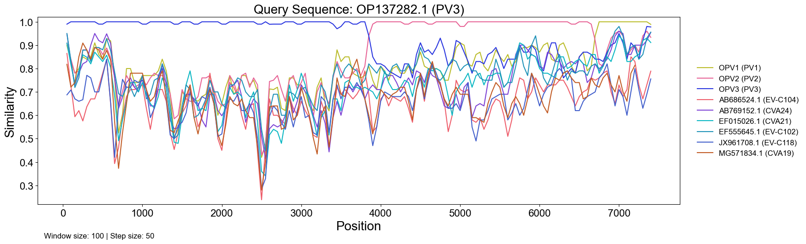

# SimPlot-CL: A Command-Line Similarity Plot Generator
<sup><ins>Keno Strotjohann</ins> & Emma B Hodcroft</sup>

SimPlot-CL is a simplified, Python-based command-line reimplementation of the classic SimPlot program (Lole et al., 1999). It lets you generate similarity plots (SimPlots) and pairwise similarity tables directly from sequence alignments, without the need for a GUI.

I built this mainly for my own viral genomics work, where I wanted to run lots of SimPlot analyses automatically instead of clicking through the Windows interface a hundred times.
If you have the same problem, this might save you some time too.

If you use this program and wish to cite it, please cite both this repository (see citation file) and the classic SimPlot program by [Lole et al.](https://pubmed.ncbi.nlm.nih.gov/9847317/) (as well as [MAFFT](https://mafft.cbrc.jp/alignment/software/), if appropriate).

## What this does

Given one or more viral genome sequences in a fasta file, the script:
1. Aligns the sequences (optional; when an alignment is given as input, this step can be skipped with `--no-align`)
2. Splits the alignment into overlapping windows of a chosen size.
3. Calculates the pairwise distance between a query and other sequences in each window.
4. Produces:
    a) a plot showing how similarity changes along the genome, and
    b) a CSV table with similarity values (optional).




## How similarity is calculated

For each sliding window, the distance between the query and each reference sequence is computed from the valid (unambiguous nucleotide) positions in that window. Positions containing gaps or ambiguous characters are excluded. The similarity plotted is `1 − distance`.

Five distance models are currently available (see `--distance-model`):

| Model | Description |
|-------|-------------|
| `pdist` | p-distance: raw proportion of differing sites (default) |
| `jc69` | Jukes-Cantor 1969: accounts for unseen mutations, assumes equal base frequencies and single substitution rate |
| `k80` | Kimura 1980: separate rates for transitions and transversions |
| `hky` | Hasegawa-Kishino-Yano 1984/85: empirical base frequencies, single transition rate |
| `tn93` | Tamura-Nei 1993: empirical base frequencies, separate purine/pyrimidine transition rates |

For `hky` and `tn93`, base frequencies are estimated from the full alignment by default. Per-window estimation can be enabled with `--local-freqs`.

If a distance formula is undefined for a window (e.g. due to sequence saturation), that window is shown as a gap in the plot and recorded as `NaN` in the CSV.

Windows are centered such that every plotted point represents exactly `--windowsize` sites. The first center is at position `windowsize // 2` and the last is the final position where a full window still fits within the alignment; edge positions are not covered by truncated windows.


## Requirements and Installation
Requires Python ≥ 3.9 and the following libraries:

```
biopython
mafft
pandas
numpy
matplotlib
argcomplete
```

We recommend using micromamba for fast and reliable environment creation. To create the environment from the provided ```environment.yml```, run:

```
micromamba create -f environment.yml
micromamba activate simplot
```

If you prefer conda, you can create the same environment with:

```
conda env create -f environment.yml
conda activate simplot
```

## Usage

The script can run in two main ways:

1️⃣ **Using one fasta file - specify query ID(s)**

```python simplot.py -s sequences.fasta -q Query1 Query2```

SimPlots will be generated for Query1 and Query2 in sequences.fasta, using all other sequences in sequences.fasta as references.

2️⃣ **Using separate query and reference fastas**

```python simplot.py -s sequences.fasta -r references.fasta```

SimPlots will be generated for all sequences in sequences.fasta, using all sequences in references.fasta as references.

Window size, step size, distance model, output directories, metadata, colors, etc. can be customized using the arguments listed below.

## Arguments

| Flag                             | Description                                                                    |
| -------------------------------- | ------------------------------------------------------------------------------ |
| `-s`, `--sequences`              | Path to the main sequence file (.fasta)                                        |
| `-q`, `--query-id`               | ID of query sequence(s) within the alignment (mutually exclusive with `-r`).  |
| `-i`, `--include-queries-as-refs` | If set, treat other `--query-id` sequences as references for each query (default: excluded). |
| `-r`, `--reference-sequences`    | Path to a separate reference fasta (mutually exclusive with `-q`).            |
| `-n`, `--no-align`               | If set, skip MAFFT alignment. Input sequences must already be aligned.        |
| `-t`, `--threads`                | Number of threads for MAFFT alignment (default: 1).                           |
| `-dm`, `--distance-model`        | Distance model: `pdist` (default), `jc69`, `k80`, `hky`, `tn93`. See above.  |
| `-lf`, `--local-freqs`           | Estimate base frequencies per window rather than from the full alignment (only affects `hky` and `tn93`). |
| `-mgf`, `--max-gap-frequency`    | Maximum allowed proportion of gap/ambiguous positions per window (default: 0.1). Windows exceeding this threshold are skipped and shown as gaps in the plot. |
| `-ws`, `--windowsize`            | Window size in nucleotides (default: 100).                                    |
| `-ss`, `--stepsize`              | Step size between window centers (default: 50).                               |
| `-m`, `--metadata`               | Optional CSV/TSV file mapping sequence IDs to genotypes.                      |
| `-mi`, `--metadata-id-col`       | Column name in metadata for sequence IDs (default: `Accession`).             |
| `-mg`, `--metadata-genotype-col` | Column name in metadata for genotype info (default: `Genotype`).             |
| `-mm`, `--metadata-mode`         | Whether metadata applies to `query`, `reference`, or `both` (default: `both`). |
| `-c`, `--colors`                 | Optional file mapping genotypes to colors (`tsv` or `csv`).                  |
| `-f`, `--outformat`              | Output plot format: `png` (default), `pdf`, `svg`, or `jpg`.                 |
| `-ht`, `--height`                | Figure height in inches (default: 5.0).                                       |
| `-wd`, `--width`                 | Axes width in inches (default: 14.0).                                         |
| `-p`, `--outplots`               | Directory for plot outputs (default: `simplots/`).                            |
| `-o`, `--outcsv`                 | Directory for CSV outputs (optional).                                         |
| `-oa`, `--outaln`                | Output path for the alignment in fasta format (optional).                     |


## Output

Each run creates:
- One or multiple similarity plots (`simplots/<query>_<model>_simplot.png`)
- A similarity table (`<query>_<model>_similarity_results.csv`, if `--outcsv` is set)
- An alignment fasta (if `--outaln` is set)

Plots show:
- Genome position on the x-axis
- Similarity (1 − distance) on the y-axis
- One line per reference sequence (colored by genotype if metadata is provided)
- Window size, step size, and distance model shown in the lower left corner


## Examples

**Simple run** <br>
Compare two query sequences to all other sequences in the same alignment (sequences are already aligned, so `--no-align` is used):

```
python simplot.py \
    -s demo_data/query_alignment.fasta \
    -q OP137282.1 JX274981.1 \
    -ws 150 \
    -ss 50 \
    -p simplots \
    --no-align
```
<br>

**With a separate reference alignment** <br>
Compare all query sequences in query_alignment.fasta to all references in references_alignment.fasta:

```
python simplot.py \
    -s demo_data/query_alignment.fasta \
    -r demo_data/reference_alignment.fasta \
    -ws 200 \
    -ss 100 \
    -p simplots \
    --no-align
```
<br>

**With a model-based distance, metadata and custom colors** <br>
Use the TN93 distance model and annotate sequences by genotype:

```
python simplot.py \
    -s demo_data/query_alignment.fasta \
    -r demo_data/reference_alignment.fasta \
    -dm tn93 \
    -m demo_data/metadata.csv \
    -c demo_data/colors.tsv \
    --no-align
```
<br>

Providing a metadata.csv/tsv file (`-m`) which maps sequence IDs to genotypes enables annotation of genotypes in the output plots as well as coloring the lines by genotype. Default expected metadata column names are "Accession" and "Genotype", but other column names can be specified using `--metadata-id-col` (`-mi`) and `--metadata-genotype-col` (`-mg`). Custom genotype colors can be used by providing a colors.csv/tsv (`-c`) file which maps genotype names to color codes.

Example `metadata.csv`:
```
Accession, Genotype
Query1, Genotype A
Ref1, Genotype B
Ref2, Genotype C
```

Example `colors.tsv`:
```
Genotype A	#1f77b4
Genotype B	#ff7f0e
Genotype C	#2ca02c
```

## References

**Original SimPlot software**: https://sray.med.som.jhmi.edu/SCRoftware/SimPlot/ <br>
Lole, Kavita S., et al. "Full-length human immunodeficiency virus type 1 genomes from subtype C-infected seroconverters in India, with evidence of intersubtype recombination." Journal of virology 73.1 (1999): 152-160.

**SimPlot++** (modern GUI version): https://github.com/Stephane-S/Simplot_PlusPlus <br>
Samson, Stéphane, Étienne Lord, and Vladimir Makarenkov. "SimPlot++: a Python application for representing sequence similarity and detecting recombination." Bioinformatics 38.11 (2022): 3118-3120.

**MAFFT**: https://mafft.cbrc.jp/alignment/software/ <br>
Katoh, Kazutaka, and Daron M. Standley. "MAFFT multiple sequence alignment software version 7: improvements in performance and usability." Molecular biology and evolution 30.4 (2013): 772-780.
